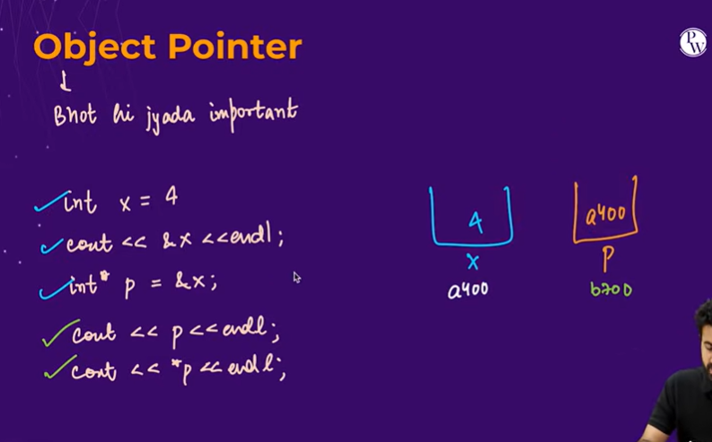

       cout<<*p<<endl;   // to print the value, star p matlab p ke address pe jao and uske value batao , p ka khudka bhi koi address hoga

#include<bits/stdc++.h>
using namespace std;

class Cricketer{
public:
string name;
int runs;
float avg;
Cricketer(string name,int runs,float avg){
this->name=name;
this->runs=runs;
this->avg=avg;
}

};
int main(){
Cricketer c1("Virat",25000,55.2);
Cricketer c2("Rohit",18000,47.5);

       int x=4;
       cout<<&x<<endl;  //0x67eebff96c

       int *p=&x;     //x ka address p mei dal diya
       cout<<p<<endl;
       cout<<*p<<endl;   // to print the value, star p matlab p ke address pe jao and uske value batao , p ka khudka bhi koi address hoga
       //iske help se hum x ke value bhi change kar sakte hai

}
